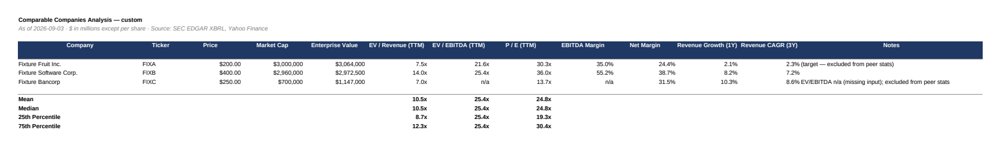
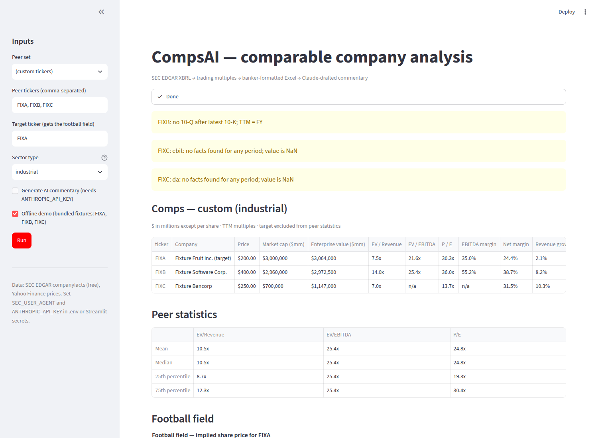

# CompsAI — AI-assisted comparable company analysis

CompsAI turns a list of tickers into a banker-formatted trading-comps workbook. It pulls
each company's financials straight from SEC EDGAR's free XBRL API (no Bloomberg, no paid
data), builds trailing-twelve-month figures, computes enterprise value and the standard
multiples (EV/Revenue, EV/EBITDA, P/E — or P/E and P/TBV for banks), and writes an Excel
file where every number on the Comps sheet is a live formula tracing back to an Inputs
sheet, with `MEDIAN`/`QUARTILE` formulas for the peer statistics and a football-field chart
for the target. On top of the numbers, Claude reads each company's latest 10-K and drafts
the parts an analyst writes by hand — non-recurring items to normalise out of EBITDA and a
premium/discount rationale versus the peer median — with every claim tied to a short
verbatim quote that the code verifies against the filing. It exists so that the valuation
logic is open, reproducible and explainable line by line in an interview.

> Status: Modules 1–5 are built and tested offline (197 tests). Live EDGAR/Yahoo/Anthropic
> calls are implemented but were **not** exercised from the build sandbox (no outbound
> network); see [Limitations](#limitations). Finance conventions the brief said to confirm
> with Brett are listed in [DECISIONS.md](DECISIONS.md).

## Screenshots

| Excel comps sheet (`output/comps_*.xlsx`) | Streamlit app |
|---|---|
|  |  |

Both come from the offline demo (fixture companies). Regenerate them with:

```bash
pip install pypdfium2 playwright && playwright install chromium   # one-off
python scripts/make_screenshots.py     # LibreOffice renders the Comps sheet; Playwright drives the app
```

## Quick start

```bash
git clone https://github.com/BigB05092007/compsai.git && cd compsai
python -m venv .venv && source .venv/bin/activate      # or: uv venv && source .venv/bin/activate
pip install -r requirements.txt                        # or: uv pip install -r requirements.txt
cp .env.example .env                                   # then edit:
#   SEC_USER_AGENT="CompsAI you@example.com"           # required by SEC's fair-access policy
#   ANTHROPIC_API_KEY=sk-ant-...                       # only for the AI commentary
```

Run the pieces:

```bash
# Module 1: financials for a few tickers (4 fiscal years + TTM), with the XBRL tags used
python -m compsai.edgar AAPL MSFT GOOGL --debug

# Whole pipeline on a named peer set with a target -> output/comps_us_large_software_<date>.xlsx
python -m compsai.pipeline --peer-set us_large_software --target MSFT

# Custom peers, banks, no AI
python -m compsai.pipeline --tickers JPM,BAC,WFC,C --target GS --sector-type bank --no-ai --name banks

# Streamlit app (also deployable to Streamlit Community Cloud; see the docstring in the app)
streamlit run app/streamlit_app.py

# Tests (fully offline: bundled EDGAR fixtures + a fake Anthropic client)
pytest -q
```

**Offline demo.** Pass `--offline` (or tick "Offline demo" in the app) to run on the bundled
fixture companies `FIXA`, `FIXB`, `FIXC` without any network access:

```bash
python -m compsai.pipeline --tickers FIXA,FIXB,FIXC --target FIXA --offline
```

**Real fixtures.** The bundled fixtures are synthetic (see Limitations). To replace them with
real EDGAR documents once you have network access:

```bash
python -m compsai.edgar AAPL MSFT JPM --save-fixture tests/fixtures
```

## How it works

| Stage | Module | What happens |
|---|---|---|
| 1 | `compsai/edgar.py` | Ticker → CIK, then `companyfacts` JSON (cached in `data/cache/`, ≤ 9 requests/s). For each concept the XBRL tags are tried in order **per fiscal period**, the fiscal-year label comes from the first filing that reported the period and the value from the latest (restated) one, and TTM = FY + YTD current − YTD prior from the newest 10-Q. Diagnostics (`tags_used`, `warnings`) ride on `DataFrame.attrs`. |
| 1b | `compsai/market.py` | Last price and shares outstanding from yfinance, falling back to the 10-K cover-page share count (`dei:EntityCommonStockSharesOutstanding`); manual overrides supported. |
| 2 | `compsai/valuation.py` | Enterprise value, multiples, margins, growth; outlier bounds; peer statistics (target excluded); implied-valuation ranges for the football field. |
| 3 | `compsai/excel.py` | `Inputs` (blue hardcodes) → `Comps` (black formulas, `MEDIAN`/`QUARTILE` stats over stat-eligible helper columns) → `Football Field` (stacked bar chart) → `Commentary`. |
| 4 | `compsai/ai_commentary.py` | Latest 10-K from the submissions index → HTML stripped → Item 7 and Item 1A cut out by heading regex (skipping the table of contents) → two JSON-only prompts (`compsai/prompts/`) → quotes verified against the filing. |
| 5 | `app/streamlit_app.py` | Sidebar inputs, per-stage progress, formatted tables, Altair football field, commentary expanders, xlsx download. |

`compsai/pipeline.py` runs the stages in order and isolates failures: a ticker that cannot be
loaded is skipped with a warning; only an empty peer set aborts the run.

Units everywhere: money in **USD millions**, share counts in **millions**, per-share values in
USD, margins/growth as fractions, multiples as plain floats (12.3 = 12.3x). See
[docs/DESIGN.md](docs/DESIGN.md) for the full interface contract.

## Methodology (interview prep)

**Enterprise value.**
`EV = market cap + total debt + minority interest + preferred equity − cash`.
EV is the price of the whole business for *all* capital providers. Market cap only pays the
common shareholders; a buyer also inherits the debt (add it), owes the minority holders of
consolidated subsidiaries and the preferred holders (add them), and gets the cash (subtract
it — it can be used to pay down the debt on day one). Because EV belongs to all capital
providers, it is compared with metrics that are also *before* interest: revenue and EBITDA.
Equity value, by contrast, is compared with metrics *after* interest: net income / EPS and
book value.

**EV / Revenue.** How many dollars of enterprise value the market pays per dollar of sales.
Useful when EBITDA is negative or distorted (early-stage software) and for a quick sanity
check across sectors; blunt because it ignores margins.

**EV / EBITDA.** The workhorse trading multiple. EBITDA = operating income + depreciation and
amortisation approximates pre-tax operating cash flow, is unaffected by capital structure
(before interest) and by tax jurisdiction (before tax), and by accounting choices about the
useful lives of assets (before D&A). A higher multiple means the market expects more growth,
better margins, or lower risk than the peers. It is meaningless when EBITDA ≤ 0 and suspect
above ~100x, so those values are shown but excluded from the statistics.

**P / E.** Share price ÷ diluted earnings per share (TTM). An *equity* multiple: what
shareholders pay per dollar of the profit that belongs to them, after interest and tax.
Distorted by leverage, one-time items and tax rates, which is why EV/EBITDA is usually the
lead multiple for industrials — but P/E is what the press and most investors quote.

**Banks: P / E and P / TBV.** For a bank, debt (deposits, borrowings) is the raw material
of the business rather than a financing choice, so EV and EBITDA have no meaning. Banks are
valued on equity metrics: P/E, and price to *tangible* book value — common equity minus
goodwill and intangibles (preferred stock is taken out too, since the share price belongs to
common holders), i.e. the hard capital the bank holds. A bank earning above its cost of
equity trades above 1x TBV; the gap versus peers reflects return on tangible equity and
risk.

**Trailing twelve months (TTM).** The last four quarters, so every company is measured over
the same recent window regardless of fiscal year end:
`TTM = latest fiscal year + year-to-date this year − year-to-date last year`,
taken from the newest 10-Q. Balance-sheet items (debt, cash) are simply the latest balance
sheet.

**Why outliers stay in the table but leave the statistics.** A negative EV/EBITDA or a 500x
P/E is real information about that company (it lost money, or earnings collapsed) but it is
not a benchmark; averaging it in would swing the median the whole analysis rests on. So the
value is displayed with a note, and the mean/median/quartiles are computed only over
"meaningful" values. The same rule is coded twice on purpose — in Python
(`valuation.is_meaningful`) and in Excel (the stat-eligible helper columns) — so both agree.

**Peer statistics and the football field.** Mean, median, 25th and 75th percentile of each
multiple across the peers (the target is excluded from its own benchmark). The football
field applies the 25th and 75th percentile multiples to the target's own metric — e.g.
implied EV = peer EV/EBITDA × target EBITDA — then bridges back to an implied share price
(EV − debt − minority − preferred + cash, ÷ shares). Each bar is the range of prices the
peers imply; the current price line shows whether the stock sits inside it.

**Grounded AI commentary.** Claude never sees a number it could invent: it is given the
extracted MD&A / Risk Factors text and a table of the company's multiples versus the peer
median, and must return JSON only. Every normalisation item carries a verbatim quote of
fewer than 15 words; the code checks each quote against the filing and marks it
`verified` (or not) in the Commentary sheet. The premium/discount view must cite the
multiples table and the filing's own growth, margin and risk language.

## Project structure

```
compsai/
├── CLAUDE.md                        # the original project brief (build order, acceptance criteria)
├── README.md, DECISIONS.md          # this file; finance-judgment questions for Brett
├── docs/DESIGN.md                   # interface contract: units, schemas, algorithms, Excel layout
├── requirements.txt, pyproject.toml, .env.example
├── config/peer_sets.yaml            # named peer groups with sector_type (industrial | bank)
├── compsai/
│   ├── edgar.py                     # Module 1: SEC EDGAR pull, fiscal years + TTM
│   ├── market.py                    # Module 1b: price and shares outstanding
│   ├── valuation.py                 # Module 2: EV, multiples, stats, football field
│   ├── excel.py                     # Module 3: openpyxl workbook with live formulas
│   ├── ai_commentary.py             # Module 4: 10-K download, section extraction, Claude
│   ├── prompts/normalize.md, premium_discount.md
│   ├── models.py                    # CompanyData / CommentaryResult / PipelineResult
│   └── pipeline.py                  # orchestrates 1 → 4 end to end (+ CLI)
├── app/streamlit_app.py             # Module 5
├── tests/                           # pytest, fully offline
│   ├── test_edgar.py, test_market.py, test_valuation.py, test_excel.py,
│   ├── test_ai_commentary.py, test_pipeline.py, excel_recalc.py
│   └── fixtures/                    # synthetic EDGAR JSON, a 10-K HTML, sample commentary
├── output/                          # generated xlsx (gitignored)
└── data/cache/                      # cached EDGAR / market responses (gitignored)
```

## Conventions and open decisions

The brief asked that finance-judgment calls (debt composition, leases, P/TBV, exclusion
bounds, TTM construction, …) be confirmed with Brett rather than chosen silently. Each one is
implemented with a documented default and written up as a question, with the code location,
in [DECISIONS.md](DECISIONS.md).

## Limitations

* **Synthetic test fixtures.** The build environment could not reach sec.gov, so the
  bundled `companyfacts_FIX*.json` files are hand-built, schema-exact EDGAR documents for
  fictional companies, chosen to exercise real-world quirks (Apple's revenue tag switch,
  52/53-week year ends, Microsoft's D&A tag, restated comparatives, a bank without EBITDA).
  Replace them with real data via `--save-fixture` and re-check the hand-calculated tests.
* **Live paths are untested.** yfinance, EDGAR and the Anthropic API are called through the
  documented, current interfaces, but the first live run may surface a tag or field the
  fixtures did not anticipate — the `--debug` flag on `compsai.edgar` prints exactly which
  XBRL tag fed each number.
* **Foreign filers.** 20-F/40-F filers with IFRS tags are best effort; 6-K filings carry no
  XBRL, so their TTM equals the last fiscal year. SEDAR+ is not supported.
* **Basic, not diluted, share counts** for market cap (no treasury-stock method).
* **yfinance** is an unofficial Yahoo Finance client; when it fails, pass prices with
  `price_overrides` (pipeline) or enter them in the app.

## Provenance

Built with Claude Code from the brief in [`CLAUDE.md`](CLAUDE.md). The build history,
adversarial review and CI runs are in
[Winny-Math PR #16](https://github.com/BigB05092007/Winny-Math/pull/16); this repository is the
`compsai/` folder of that branch split out with `git subtree`.

## License

MIT — see [LICENSE](LICENSE).
